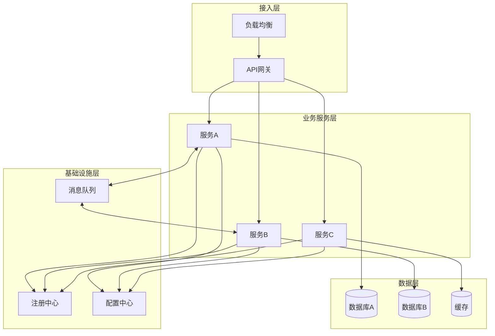

# 微服务架构Wiki示例

本文档提供微服务架构项目的Wiki目录结构和文档模板。

---

## 推荐目录结构

```
docs/
├── README.md                          # Wiki首页
├── 01-整体架构/
│   ├── 01-技术栈说明.md               # 技术栈详细说明
│   ├── 02-系统架构说明.md             # 微服务整体架构图
│   ├── 03-业务架构说明.md             # 业务域划分【重点】
│   ├── 04-服务拆分说明.md             # 服务边界、拆分原则
│   ├── 05-服务通信说明.md             # RPC/HTTP/MQ
│   └── 06-部署拓扑说明.md             # 部署架构图
├── 02-基础设施/
│   ├── 01-网关服务.md                 # Gateway/Zuul
│   ├── 02-注册中心.md                 # Nacos/Eureka
│   ├── 03-配置中心.md                 # Nacos/Apollo
│   ├── 04-链路追踪.md                 # Skywalking/Zipkin
│   └── 05-监控告警.md                 # Prometheus/Grafana
├── 03-业务服务/
│   ├── 01-[服务A].md                  # 每个微服务一个文档
│   ├── 02-[服务B].md
│   └── ...
├── 04-公共模块/
│   ├── 01-公共组件.md                 # common模块
│   └── 02-SDK说明.md                  # 对外SDK
├── 05-数据库设计/
│   ├── 01-数据库概述.md               # 分库策略
│   ├── 02-[服务A]数据库.md            # 每个服务的数据库
│   └── ...
├── 06-开发规范/
│   ├── 01-代码规范.md
│   ├── 02-命名规范.md
│   ├── 03-分层规范.md
│   └── 04-API规范.md
├── 07-部署运维/
│   ├── 01-本地开发环境.md
│   ├── 02-Docker部署.md
│   ├── 03-K8s部署.md
│   └── 04-CI-CD流程.md
└── 08-附录/
    ├── 01-术语表.md                   【重点】
    └── 02-常见问题.md
```

---

## 微服务架构图模板



---

## 服务拆分说明模板

```markdown
# 服务拆分说明

## 拆分原则

- 按业务领域拆分
- 按团队职责拆分
- 按变更频率拆分

## 服务清单

| 服务名 | 职责 | 端口 | 数据库 | 依赖服务 |
|-------|------|-----|-------|---------|
| gateway | API网关 | 8080 | - | - |
| service-user | 用户服务 | 8001 | db_user | - |
| service-order | 订单服务 | 8002 | db_order | service-user |
| service-pay | 支付服务 | 8003 | db_pay | service-order |

## 服务依赖关系

[Mermaid graph展示服务依赖]

## 服务边界

### 服务A
- **职责范围**：[做什么]
- **不负责**：[不做什么]
- **对外接口**：[提供什么接口]
- **依赖接口**：[调用什么接口]
```

---

## 服务通信说明模板

```markdown
# 服务通信说明

## 通信方式

| 场景 | 方式 | 协议 | 说明 |
|-----|------|------|------|
| 同步调用 | Feign/Dubbo | HTTP/RPC | 需要立即返回结果 |
| 异步通知 | RabbitMQ/Kafka | AMQP | 不需要立即返回 |
| 事件广播 | MQ | - | 一对多通知 |

## 核心接口契约

### 服务A -> 服务B

| 接口 | 方法 | 说明 |
|-----|------|------|
| /api/user/{id} | GET | 获取用户信息 |

## 消息定义

| Topic/Queue | 生产者 | 消费者 | 消息体 |
|------------|-------|-------|-------|
| order.created | 订单服务 | 支付服务 | OrderCreatedEvent |
```

---

## 基础设施文档模板

```markdown
# [基础设施名称]

## 概述

[组件作用说明]

## 技术选型

| 组件 | 版本 | 说明 |
|-----|------|------|

## 配置说明

[核心配置项]

## 使用方式

[如何接入、如何使用]

## 运维要点

[启动命令、健康检查、常见问题]
```

---

## 业务服务文档模板

```markdown
# [服务名称]

## 服务概述

| 项目 | 说明 |
|-----|------|
| 服务名称 | xxx-service |
| 端口 | 8001 |
| 数据库 | db_xxx |
| 职责 | [做什么] |

## 模块结构

[服务内部模块划分]

## 对外接口

| 接口 | 方法 | 说明 |
|-----|------|------|

## 依赖服务

| 服务 | 接口 | 用途 |
|-----|------|------|

## 消息订阅

| Topic/Queue | 用途 |
|------------|------|

## 数据库表

| 表名 | 说明 |
|-----|------|
```

---

## 部署文档模板

```markdown
# Docker部署

## 镜像构建

docker build -t xxx-service:latest .

## Docker Compose

[docker-compose.yml示例]

---

# K8s部署

## Deployment

[deployment.yaml示例]

## Service

[service.yaml示例]

## ConfigMap

[configmap.yaml示例]
```
