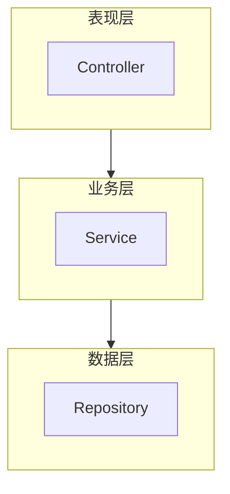
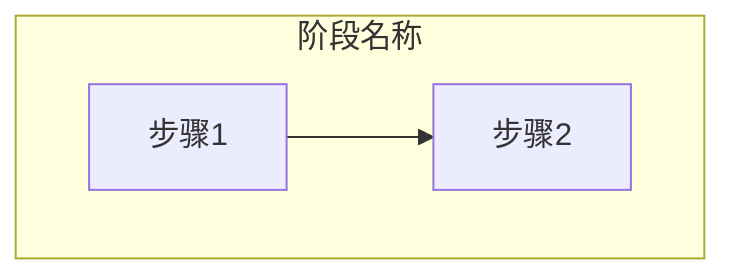
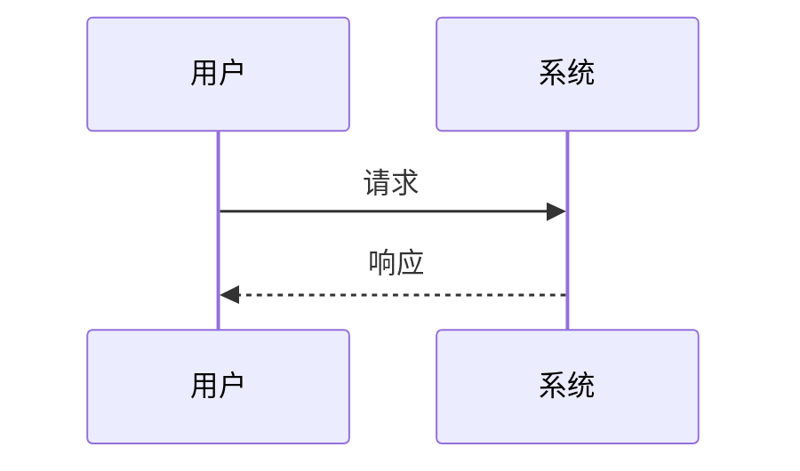
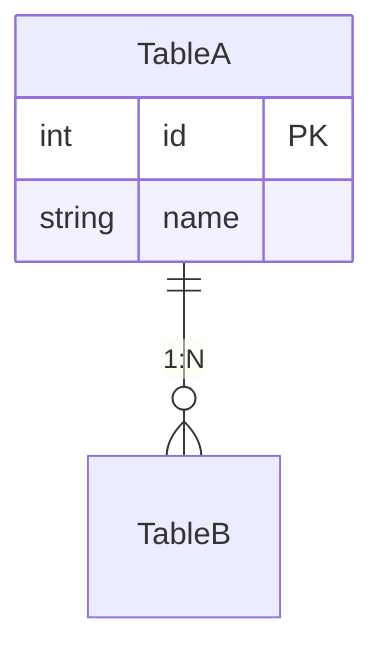
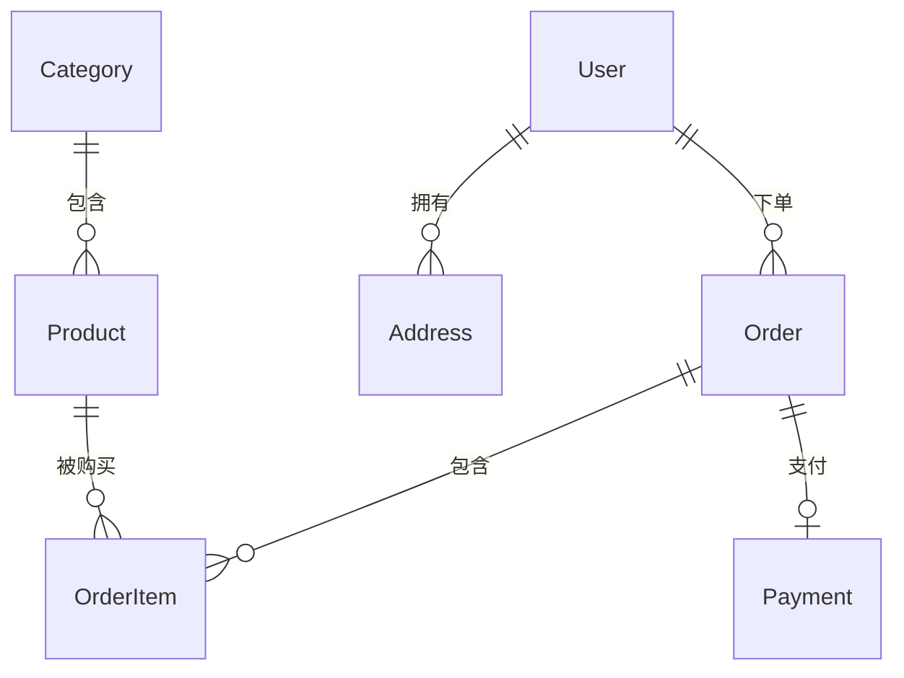

# 项目Wiki生成技能

本技能用于为代码仓库生成专业、完整的项目Wiki文档。

## 适用场景

- 新接手的项目需要梳理文档
- 项目缺乏技术文档，需要补充
- 团队新成员需要快速了解项目全貌
- 项目交接、知识传承

## 支持的项目类型

| 类型 | 特征 | 参考示例 |
|-----|------|---------|
| 单体应用 | 单一代码库、单一部署单元 | [单体架构示例](examples/monolithic-example.md) |
| 微服务架构 | 多个服务、独立部署 | [微服务架构示例](examples/microservice-example.md) |

---

## 生成流程

### 第一阶段：项目分析

#### 1. 识别项目架构类型

**单体应用特征**：
- 单个 `pom.xml` / `package.json`
- 统一的 `application.properties` 配置
- 代码在同一个 `src` 目录下

**微服务架构特征**：
- 父 `pom.xml` + 多个子模块
- 每个服务有独立配置
- 存在服务注册中心配置（Nacos/Eureka/Consul）
- 存在网关配置（Gateway/Zuul）

#### 2. 分析项目结构

- 构建文件（pom.xml / package.json）
- 配置文件（bootstrap.yml / application.yml / application.properties）
- 代码结构（controller/service/repository）
- 数据库实体

---

### 第二阶段：Wiki结构规划

根据项目类型选择对应的Wiki结构模板：
- 单体应用：参考 [单体架构示例](examples/monolithic-example.md)
- 微服务架构：参考 [微服务架构示例](examples/microservice-example.md)

---

## 【核心】业务架构说明编写指南

> **这是最重要的文档**，决定了读者能否快速理解项目业务。

### 必须包含的7个模块

#### 1. 行业背景介绍

```markdown
## 行业背景

### 什么是[行业/领域]？

[用通俗易懂的语言解释行业概念]

### 行业痛点与解决方案

| 传统模式痛点 | 本系统解决方案 |
|------------|--------------|
| [痛点1] | [如何解决] |

### 本系统在业务链中的定位

[使用流程图展示本系统与上下游的关系]
```

#### 2. 核心业务场景（必须3个以上）

```markdown
### 场景一：[场景名称]

**业务背景**：[什么情况下会触发这个场景]

**参与角色**：
- 角色A：负责什么

**业务流程**：
[Mermaid时序图]

**流程要点**：
1. **步骤1**：[做什么]，[为什么]
```

#### 3. 业务流程详解

```markdown
### [核心业务]全流程

[Mermaid flowchart，使用subgraph划分阶段]

### 各阶段详解

| 阶段 | 主要活动 | 参与角色 | 产出物 |
|-----|---------|---------|-------|
```

#### 4. 业务规则与计算逻辑

```markdown
### 计算逻辑示例

假设条件：
- 参数A = 1000

计算过程：
1. 第一步：...

最终结果：...

**边界情况**：
- 当...时：[如何处理]
```

#### 5. 核心概念对比

```markdown
### [概念A] vs [概念B]

| 对比维度 | 概念A | 概念B |
|---------|------|------|
| **定义** | ... | ... |
| **适用场景** | ... | ... |
```

#### 6. 业务域划分

```markdown
## 业务域划分

[Mermaid架构图：核心域、支撑域、基础域]

| 域 | 模块 | 职责 |
|---|-----|------|
```

#### 7. 学习建议

```markdown
## 学习建议

1. **先理解业务场景**：在看代码前，先理解完整流程
2. **抓住核心实体**：[列出核心实体]
3. **建议阅读顺序**：先看A → 再看B → 最后看C
```

#### 8. 核心流程识别与详解

> **核心流程是系统最重要的业务路径**，必须识别并详细说明。

**核心流程识别标准**：
1. **高频使用**：每日执行次数最多的流程
2. **业务价值高**：直接产生收入或核心业务价值
3. **链路最长**：涉及多个模块协作的端到端流程
4. **复杂度高**：包含复杂计算、状态流转的流程

```markdown
## 核心流程清单

| 流程名称 | 重要性 | 涉及模块 | 触发场景 |
|---------|-------|---------|---------|
| [流程1] | ⭐⭐⭐ | A, B, C | [何时触发] |
| [流程2] | ⭐⭐ | B, D | [何时触发] |

---

## 核心流程详解

### 流程一：[流程名称]

#### 流程概述

**业务目的**：[这个流程解决什么业务问题]

**前置条件**：
- [条件1]
- [条件2]

**后置结果**：
- [结果1]
- [结果2]

#### 流程图

[Mermaid flowchart 展示完整流程，使用 subgraph 划分阶段]

#### 关键节点详解

| 节点 | 说明 | 关键逻辑 | 代码位置 |
|-----|------|---------|---------|
| [节点1] | [做什么] | [核心逻辑] | `XxxService.method()` |
| [节点2] | [做什么] | [核心逻辑] | `YyyBlo.method()` |

#### 异常处理

| 异常场景 | 处理策略 | 回滚机制 |
|---------|---------|---------|
| [异常1] | [如何处理] | [是否回滚] |

#### 性能要点

- **预期耗时**：[正常情况下的耗时]
- **瓶颈点**：[可能的性能瓶颈]
- **优化建议**：[如何优化]
```

---

## 【核心】术语表编写指南

### 必须包含的5个分类

1. **行业背景术语**（5个以上）
2. **角色术语**（3个以上）
3. **核心业务术语**（10个以上）
4. **流程术语**（5个以上）
5. **系统术语**（可选）

### 术语格式

```markdown
### [术语名称]

**英文**：[English Name]

**定义**：[一句话定义]

**业务场景**：
[具体例子说明使用场景]

**与其他概念的关系**：
[说明关联概念]
```

---

## 图表模板

### 系统架构图



### 业务流程图



### 时序图



### ER图



### 【重要】完整ER图生成指南

> **ER图必须覆盖所有表**，通过表索引确保无遗漏。

#### ER图组织策略

**大型项目采用分模块策略**：

1. **总览ER图**：展示所有模块间的核心关联（只显示核心表）
2. **模块ER图**：每个业务模块一个详细ER图
3. **表索引表**：确保所有表都被ER图覆盖

```markdown
## 数据库ER图

### 总览图

> 展示模块间核心表的关联关系

[Mermaid erDiagram：只包含各模块核心表]

---

### 按模块划分的ER图

#### 模块A - [模块名称]

[Mermaid erDiagram：该模块所有表]

#### 模块B - [模块名称]

[Mermaid erDiagram：该模块所有表]

---

### 表索引（确保无遗漏）

| 序号 | 表名 | 所属模块 | 对应ER图 | 说明 |
|-----|------|---------|---------|------|
| 1 | table_a | 模块A | 模块A ER图 | [表用途] |
| 2 | table_b | 模块A | 模块A ER图 | [表用途] |
| 3 | table_c | 模块B | 模块B ER图 | [表用途] |
| ... | ... | ... | ... | ... |

**共计 N 张表，全部已纳入ER图**
```

#### ER图编写要点

1. **表关系完整**：必须标注所有外键关系
2. **关系类型明确**：使用 `||--o{`（一对多）、`||--||`（一对一）、`}o--o{`（多对多）
3. **说明关系含义**：使用有意义的关系标签
4. **按业务分组**：使用注释或空行分隔不同业务组的表



---

## 执行步骤

1. **确认项目信息**：项目路径、架构类型、业务领域
2. **项目分析**：技术栈、配置、代码结构、业务模块
3. **确定Wiki结构**：根据架构类型选择模板
4. **逐个编写**：
   - README首页
   - 技术架构模块
   - **业务架构说明**（重点）
   - 业务模块文档
   - 数据库设计
   - 开发规范
   - 部署运维
   - **术语表**（重点）
5. **质量检查**：图表语法、链接有效、术语一致

---

## 注意事项

1. **业务理解优先**：先理解项目做什么，再写怎么做
2. **询问业务背景**：如果从代码无法推断业务，主动询问用户
3. **图表必须有**：每个核心文档至少1个Mermaid图表
4. **业务背景详细**：业务架构说明必须有行业背景、场景说明、计算示例
5. **术语要详尽**：术语表不是简单定义，要有场景和关系说明
6. **给学习建议**：帮助读者找到学习路径
7. **逐个编写**：不要并行写多个文档，保证质量

---

## 相关资源

- [单体架构Wiki示例](examples/monolithic-example.md)
- [微服务架构Wiki示例](examples/microservice-example.md)
